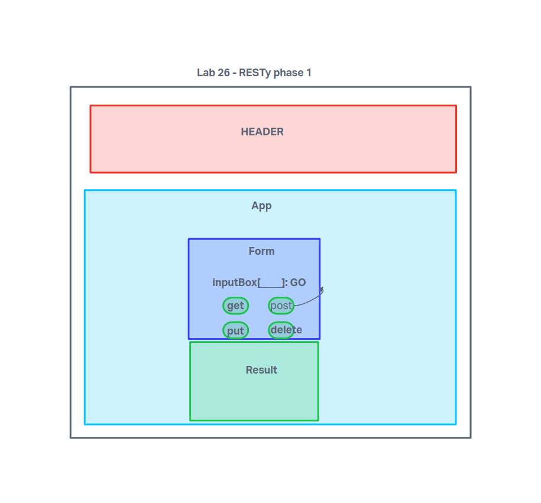

# LAB - Class 26

## Project: RESTy

### Author: Kyle Freemantle

### Problem Domain  

- RESTy is an API testing tool that is browser agnostic, allowing us to run basic API connection tests from any device.

- Phase 1 involved refactoring initial code away from class based components to functions, and implementing basic scss styling.

- Phase 2 involved adding the useState hook in preparation to connect to live APIs.

- Phase 3 involves connecting RESTy to live APIs, focusing on GET requests.

### Links and Resources

- [GitHub Actions ci/cd](https://github.com/kfreemantle/resty/actions)

### Setup

Install the package locally and run npm start.

#### `.env` requirements (where applicable)

No environmental variables to consider yet.

#### How to initialize/run your application (where applicable)

`npm start`

#### Tests

- Testing is not yet required for phase 1 of the project.
- Phase 2 and 3 testing can be run with npm test App

#### UML

